# Analysis output gallery

This folder contains the graphs and tables generated from `final.Rmd`. Open
[the detailed output report](analysis_outputs.md) to view all tables, model
metrics, confusion matrices, coefficients, and numerical results.

## Exploratory data analysis

### Race distribution

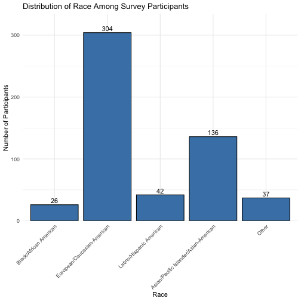

### Decisions by same-race status

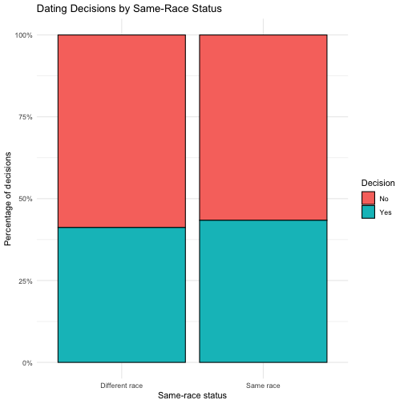

### Race decision heatmap

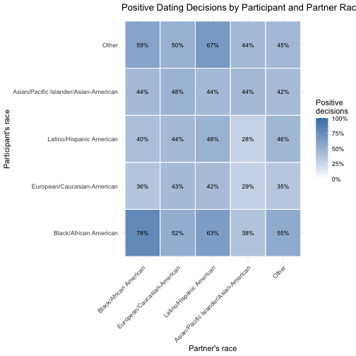

### Ratings by same-race status

- [Attractiveness](figures/eda/04_attractiveness_boxplots.png)
- [Fun](figures/eda/05_fun_boxplots.png)
- [Sincerity](figures/eda/06_sincerity_boxplots.png)
- [Shared interests](figures/eda/07_shared_interests_boxplots.png)
- [Ambition](figures/eda/08_ambition_boxplots.png)
- [Intelligence](figures/eda/09_intelligence_boxplots.png)

## Logistic regression

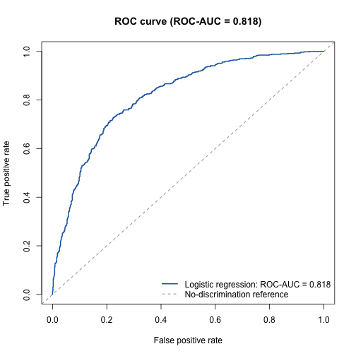

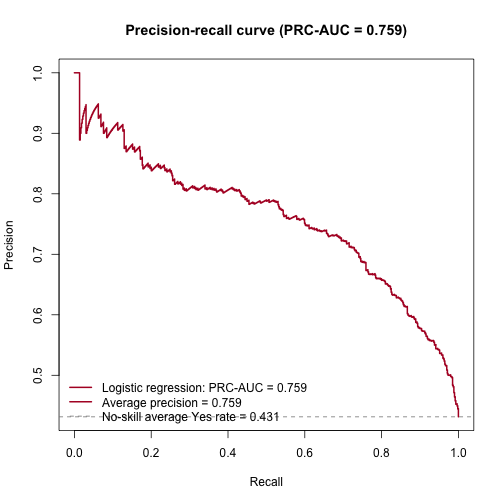

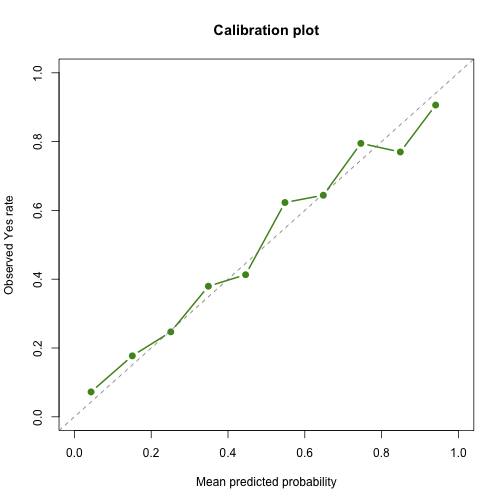

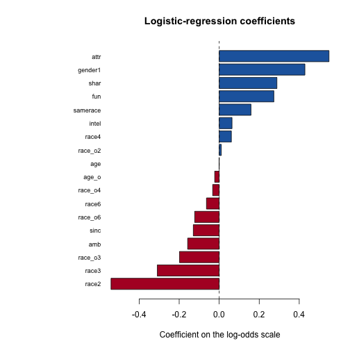

## Neural network

- [Class balance](figures/neural_network/01_class_balance.png)
- [Confusion matrix](figures/neural_network/02_confusion_matrix.png)
- [ROC curve](figures/neural_network/03_roc_curve.png)
- [Precision-recall curve](figures/neural_network/04_precision_recall_curve.png)
- [Probability distribution](figures/neural_network/05_probability_distribution.png)
- [Calibration plot](figures/neural_network/06_calibration_plot.png)
- [Permutation importance](figures/neural_network/07_permutation_importance.png)

## Random forest

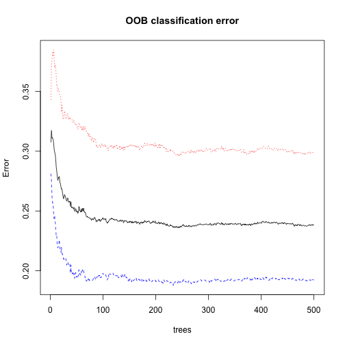

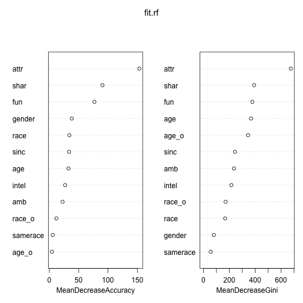

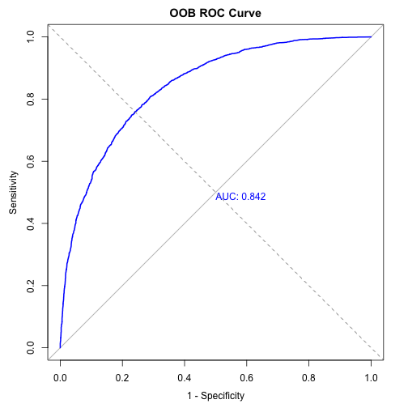

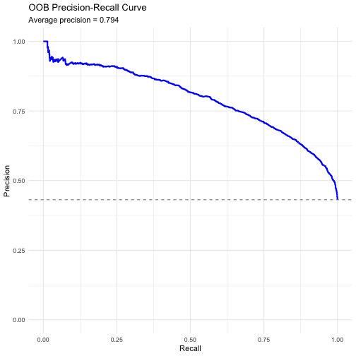

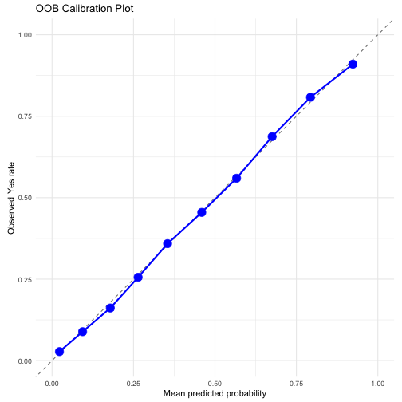
