 ## Cleaning


``` r
speed_dating_data <- readr::read_csv(
  "data/Speed_Dating_Data.csv",
  show_col_types = FALSE
)
speed_dating_data <- speed_dating_data %>%
  filter(!is.na(race))
speed_dating_data <- speed_dating_data %>%
  filter(
    is.na(race) | race != 5,
    is.na(race_o) | race_o != 5
  )

race_levels <- c(1, 2, 3, 4, 6)

race_labels <- c(
  "Black/African American",
  "European/Caucasian-American",
  "Latino/Hispanic American",
  "Asian/Pacific Islander/Asian-American",
  "Other"
)

speed_dating_data
```

```
## # A tibble: 8,315 × 195
##      iid    id gender   idg condtn  wave round position positin1 order partner
##    <dbl> <dbl>  <dbl> <dbl>  <dbl> <dbl> <dbl>    <dbl>    <dbl> <dbl>   <dbl>
##  1     1     1      0     1      1     1    10        7       NA     4       1
##  2     1     1      0     1      1     1    10        7       NA     3       2
##  3     1     1      0     1      1     1    10        7       NA    10       3
##  4     1     1      0     1      1     1    10        7       NA     5       4
##  5     1     1      0     1      1     1    10        7       NA     7       5
##  6     1     1      0     1      1     1    10        7       NA     6       6
##  7     1     1      0     1      1     1    10        7       NA     1       7
##  8     1     1      0     1      1     1    10        7       NA     2       8
##  9     1     1      0     1      1     1    10        7       NA     8       9
## 10     1     1      0     1      1     1    10        7       NA     9      10
## # ℹ 8,305 more rows
## # ℹ 184 more variables: pid <dbl>, match <dbl>, int_corr <dbl>, samerace <dbl>,
## #   age_o <dbl>, race_o <dbl>, pf_o_att <dbl>, pf_o_sin <dbl>, pf_o_int <dbl>,
## #   pf_o_fun <dbl>, pf_o_amb <dbl>, pf_o_sha <dbl>, dec_o <dbl>, attr_o <dbl>,
## #   sinc_o <dbl>, intel_o <dbl>, fun_o <dbl>, amb_o <dbl>, shar_o <dbl>,
## #   like_o <dbl>, prob_o <dbl>, met_o <dbl>, age <dbl>, field <chr>,
## #   field_cd <dbl>, undergra <chr>, mn_sat <dbl>, tuition <dbl>, race <dbl>, …
```

``` r
names(speed_dating_data)
```

```
##   [1] "iid"      "id"       "gender"   "idg"      "condtn"   "wave"
##   [7] "round"    "position" "positin1" "order"    "partner"  "pid"
##  [13] "match"    "int_corr" "samerace" "age_o"    "race_o"   "pf_o_att"
##  [19] "pf_o_sin" "pf_o_int" "pf_o_fun" "pf_o_amb" "pf_o_sha" "dec_o"
##  [25] "attr_o"   "sinc_o"   "intel_o"  "fun_o"    "amb_o"    "shar_o"
##  [31] "like_o"   "prob_o"   "met_o"    "age"      "field"    "field_cd"
##  [37] "undergra" "mn_sat"   "tuition"  "race"     "imprace"  "imprelig"
##  [43] "from"     "zipcode"  "income"   "goal"     "date"     "go_out"
##  [49] "career"   "career_c" "sports"   "tvsports" "exercise" "dining"
##  [55] "museums"  "art"      "hiking"   "gaming"   "clubbing" "reading"
##  [61] "tv"       "theater"  "movies"   "concerts" "music"    "shopping"
##  [67] "yoga"     "exphappy" "expnum"   "attr1_1"  "sinc1_1"  "intel1_1"
##  [73] "fun1_1"   "amb1_1"   "shar1_1"  "attr4_1"  "sinc4_1"  "intel4_1"
##  [79] "fun4_1"   "amb4_1"   "shar4_1"  "attr2_1"  "sinc2_1"  "intel2_1"
##  [85] "fun2_1"   "amb2_1"   "shar2_1"  "attr3_1"  "sinc3_1"  "fun3_1"
##  [91] "intel3_1" "amb3_1"   "attr5_1"  "sinc5_1"  "intel5_1" "fun5_1"
##  [97] "amb5_1"   "dec"      "attr"     "sinc"     "intel"    "fun"
## [103] "amb"      "shar"     "like"     "prob"     "met"      "match_es"
## [109] "attr1_s"  "sinc1_s"  "intel1_s" "fun1_s"   "amb1_s"   "shar1_s"
## [115] "attr3_s"  "sinc3_s"  "intel3_s" "fun3_s"   "amb3_s"   "satis_2"
## [121] "length"   "numdat_2" "attr7_2"  "sinc7_2"  "intel7_2" "fun7_2"
## [127] "amb7_2"   "shar7_2"  "attr1_2"  "sinc1_2"  "intel1_2" "fun1_2"
## [133] "amb1_2"   "shar1_2"  "attr4_2"  "sinc4_2"  "intel4_2" "fun4_2"
## [139] "amb4_2"   "shar4_2"  "attr2_2"  "sinc2_2"  "intel2_2" "fun2_2"
## [145] "amb2_2"   "shar2_2"  "attr3_2"  "sinc3_2"  "intel3_2" "fun3_2"
## [151] "amb3_2"   "attr5_2"  "sinc5_2"  "intel5_2" "fun5_2"   "amb5_2"
## [157] "you_call" "them_cal" "date_3"   "numdat_3" "num_in_3" "attr1_3"
## [163] "sinc1_3"  "intel1_3" "fun1_3"   "amb1_3"   "shar1_3"  "attr7_3"
## [169] "sinc7_3"  "intel7_3" "fun7_3"   "amb7_3"   "shar7_3"  "attr4_3"
## [175] "sinc4_3"  "intel4_3" "fun4_3"   "amb4_3"   "shar4_3"  "attr2_3"
## [181] "sinc2_3"  "intel2_3" "fun2_3"   "amb2_3"   "shar2_3"  "attr3_3"
## [187] "sinc3_3"  "intel3_3" "fun3_3"   "amb3_3"   "attr5_3"  "sinc5_3"
## [193] "intel5_3" "fun5_3"   "amb5_3"
```


``` r
columns_to_keep <- c(
  # Identifiers
  "iid",

  # Person's demographics and date's demographics
  "gender", "age", "race",
  "age_o", "race_o", "samerace",

  # Person's evaluation of their date
  "attr", "sinc", "intel", "fun", "amb", "shar",

  # Decisions and final match
  "dec"
)
```


``` r
speed_dating_data <- speed_dating_data %>%
  select(any_of(columns_to_keep))

names(speed_dating_data)
```

```
##  [1] "iid"      "gender"   "age"      "race"     "age_o"    "race_o"
##  [7] "samerace" "attr"     "sinc"     "intel"    "fun"      "amb"
## [13] "shar"     "dec"
```

``` r
head(speed_dating_data)
```

```
## # A tibble: 6 × 14
##     iid gender   age  race age_o race_o samerace  attr  sinc intel   fun   amb
##   <dbl>  <dbl> <dbl> <dbl> <dbl>  <dbl>    <dbl> <dbl> <dbl> <dbl> <dbl> <dbl>
## 1     1      0    21     4    27      2        0     6     9     7     7     6
## 2     1      0    21     4    22      2        0     7     8     7     8     5
## 3     1      0    21     4    22      4        1     5     8     9     8     5
## 4     1      0    21     4    23      2        0     7     6     8     7     6
## 5     1      0    21     4    24      3        0     5     6     7     7     6
## 6     1      0    21     4    25      2        0     4     9     7     4     6
## # ℹ 2 more variables: shar <dbl>, dec <dbl>
```


## EDA

``` r
race_distribution <- speed_dating_data %>%
  filter(race %in% c(1, 2, 3, 4, 6)) %>%
  distinct(iid, .keep_all = TRUE) %>%
  mutate(
    race_label = factor(
      race,
      levels = c(1, 2, 3, 4, 6),
      labels = c(
        "Black/African American",
        "European/Caucasian-American",
        "Latino/Hispanic American",
        "Asian/Pacific Islander/Asian-American",
        "Other"
      )
    )
  )

ggplot(
  race_distribution,
  aes(x = race_label)
) +
  geom_bar(fill = "steelblue", color = "black") +
  geom_text(
    stat = "count",
    aes(label = after_stat(count)),
    vjust = -0.4
  ) +
  labs(
    title = "Distribution of Race Among Survey Participants",
    x = "Race",
    y = "Number of Participants"
  ) +
  scale_y_continuous(
    expand = expansion(mult = c(0, 0.1))
  ) +
  theme_minimal() +
  theme(
    axis.text.x = element_text(angle = 45, hjust = 1)
  )
```


``` r
race_counts <- speed_dating_data %>%
  distinct(iid, .keep_all = TRUE) %>%
  mutate(
    race = factor(
      race,
      levels = race_levels,
      labels = race_labels
    )
  ) %>%
  count(race, name = "number_of_people", .drop = FALSE)

race_counts
```

```
## # A tibble: 5 × 2
##   race                                  number_of_people
##   <fct>                                            <int>
## 1 Black/African American                              26
## 2 European/Caucasian-American                        304
## 3 Latino/Hispanic American                            42
## 4 Asian/Pacific Islander/Asian-American              136
## 5 Other                                               37
```


``` r
total_unique_people <- speed_dating_data %>%
  filter(!is.na(race)) %>%
  summarise(number_of_people = n_distinct(iid)) %>%
  pull(number_of_people)
total_unique_people
```

```
## [1] 545
```


``` r
library(ggplot2)

ggplot(
  speed_dating_data,
  aes(
    x = factor(
      samerace,
      levels = c(0, 1),
      labels = c("Different race", "Same race")
    ),
    fill = factor(
      dec,
      levels = c(0, 1),
      labels = c("No", "Yes")
    )
  )
) +
  geom_bar(position = "fill", color = "black") +
  scale_y_continuous(
    labels = function(x) paste0(round(x * 100), "%")
  ) +
  labs(
    title = "Dating Decisions by Same-Race Status",
    x = "Same-race status",
    y = "Percentage of decisions",
    fill = "Decision"
  ) +
  theme_minimal()
```


``` r
# imprace is the participant's pre-event response to:
# "How important is it that a person you date be of the same racial/ethnic
# background?" It is measured from 0 (not important) to 10 (very important).
imprace_decisions <- readr::read_csv(
  "data/Speed_Dating_Data.csv",
  show_col_types = FALSE
) %>%
  filter(!is.na(imprace), !is.na(dec)) %>%
  group_by(imprace) %>%
  summarise(
    positive_decision_rate = mean(dec == 1),
    decisions = n(),
    .groups = "drop"
  )

ggplot(
  imprace_decisions,
  aes(x = imprace, y = positive_decision_rate)
) +
  geom_line(color = "steelblue", linewidth = 1) +
  geom_point(aes(size = decisions), color = "steelblue") +
  scale_x_continuous(breaks = 0:10) +
  scale_y_continuous(labels = scales::percent_format(accuracy = 1)) +
  labs(
    title = "Dating Decisions by Self-Reported Importance of Race",
    subtitle = "Point size represents the number of decisions",
    x = "Importance of sharing a racial/ethnic background (0–10)",
    y = "Positive-decision rate",
    size = "Decisions"
  ) +
  theme_minimal()
```

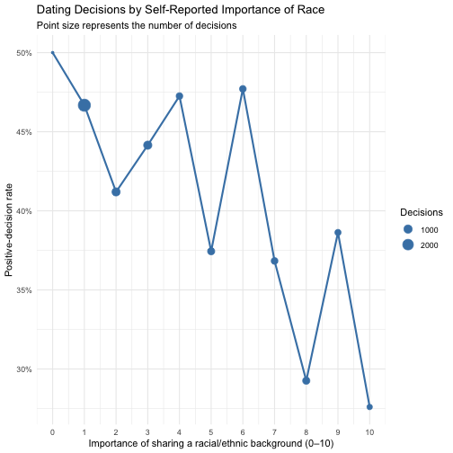


``` r
race_labels <- c(
  "Black/African American",
  "European/Caucasian-American",
  "Latino/Hispanic American",
  "Asian/Pacific Islander/Asian-American",
  "Other"
)

race_decision_heatmap <- speed_dating_data %>%
  filter(!is.na(race), !is.na(race_o), !is.na(dec)) %>%
  group_by(race, race_o) %>%
  summarise(
    mean_decision = mean(dec),
    .groups = "drop"
  ) %>%
  mutate(
    participant_race = factor(
      race,
      levels = race_levels,
      labels = race_labels
    ),
    partner_race = factor(
      race_o,
      levels = race_levels,
      labels = race_labels
    )
  )

ggplot(
  race_decision_heatmap,
  aes(
    x = partner_race,
    y = participant_race,
    fill = mean_decision
  )
) +
  geom_tile(color = "white", linewidth = 0.5) +
  geom_text(
    aes(label = paste0(round(mean_decision * 100), "%")),
    color = "black",
    size = 3
  ) +
  scale_fill_gradient(
    low = "white",
    high = "steelblue",
    limits = c(0, 1),
    labels = function(x) paste0(round(x * 100), "%")
  ) +
  scale_x_discrete(drop = FALSE) +
  scale_y_discrete(drop = FALSE) +
  labs(
    title = "Positive Dating Decisions by Participant and Partner Race",
    x = "Partner's race",
    y = "Participant's race",
    fill = "Positive\ndecisions"
  ) +
  theme_minimal() +
  theme(
    axis.text.x = element_text(angle = 45, hjust = 1)
  )
```


``` r
attractiveness_plot_data <- speed_dating_data %>%
  filter(
    race %in% c(1, 2, 3, 4, 6),
    samerace %in% c(0, 1),
    !is.na(attr)
  ) %>%
  mutate(
    race_label = factor(
      race,
      levels = c(1, 2, 3, 4, 6),
      labels = c(
        "Black/African American",
        "European/Caucasian-American",
        "Latino/Hispanic American",
        "Asian/Pacific Islander/Asian-American",
        "Other"
      )
    ),
    same_race_label = factor(
      samerace,
      levels = c(0, 1),
      labels = c("Different race", "Same race")
    )
  )

ggplot(
  attractiveness_plot_data,
  aes(
    x = same_race_label,
    y = attr,
    fill = same_race_label
  )
) +
  geom_boxplot(
    width = 0.65,
    outlier.alpha = 0.25
  ) +
  facet_wrap(~ race_label) +
  scale_fill_manual(
    values = c(
      "Different race" = "steelblue",
      "Same race" = "darkorange"
    )
  ) +
  labs(
    title = "Attractiveness Ratings by Same-Race Status",
    subtitle = "Faceted by the participant's race",
    x = "Participant and partner race",
    y = "Attractiveness rating",
    fill = "Race status"
  ) +
  theme_minimal() +
  theme(
    legend.position = "bottom",
    axis.text.x = element_text(angle = 30, hjust = 1)
  )
```

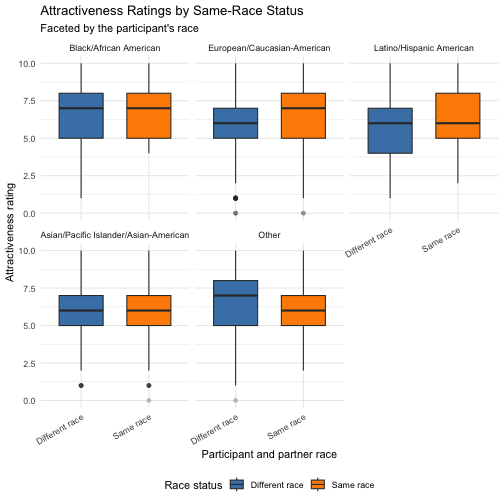

``` r
#the other 5 graphs
rating_plot_data <- speed_dating_data %>%
  filter(
    race %in% c(1, 2, 3, 4, 6),
    samerace %in% c(0, 1)
  ) %>%
  mutate(
    race_label = factor(
      race,
      levels = c(1, 2, 3, 4, 6),
      labels = c(
        "Black/African American",
        "European/Caucasian-American",
        "Latino/Hispanic American",
        "Asian/Pacific Islander/Asian-American",
        "Other"
      )
    ),
    same_race_label = factor(
      samerace,
      levels = c(0, 1),
      labels = c("Different race", "Same race")
    )
  )

#fun
ggplot(
  rating_plot_data %>% filter(!is.na(fun)),
  aes(
    x = same_race_label,
    y = fun,
    fill = same_race_label
  )
) +
  geom_boxplot(width = 0.65, outlier.alpha = 0.25) +
  facet_wrap(~ race_label) +
  scale_fill_manual(
    values = c(
      "Different race" = "steelblue",
      "Same race" = "darkorange"
    )
  ) +
  labs(
    title = "Fun Ratings by Same-Race Status",
    subtitle = "Faceted by the participant's race",
    x = "Participant and partner race",
    y = "Fun rating",
    fill = "Race status"
  ) +
  theme_minimal() +
  theme(
    legend.position = "bottom",
    axis.text.x = element_text(angle = 30, hjust = 1)
  )
```

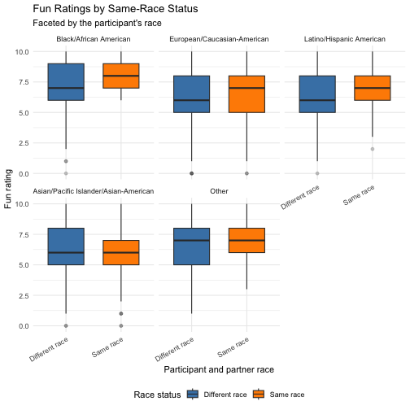

``` r
#sinc
ggplot(
  rating_plot_data %>% filter(!is.na(sinc)),
  aes(
    x = same_race_label,
    y = sinc,
    fill = same_race_label
  )
) +
  geom_boxplot(width = 0.65, outlier.alpha = 0.25) +
  facet_wrap(~ race_label) +
  scale_fill_manual(
    values = c(
      "Different race" = "steelblue",
      "Same race" = "darkorange"
    )
  ) +
  labs(
    title = "Sincerity Ratings by Same-Race Status",
    subtitle = "Faceted by the participant's race",
    x = "Participant and partner race",
    y = "Sincerity rating",
    fill = "Race status"
  ) +
  theme_minimal() +
  theme(
    legend.position = "bottom",
    axis.text.x = element_text(angle = 30, hjust = 1)
  )
```

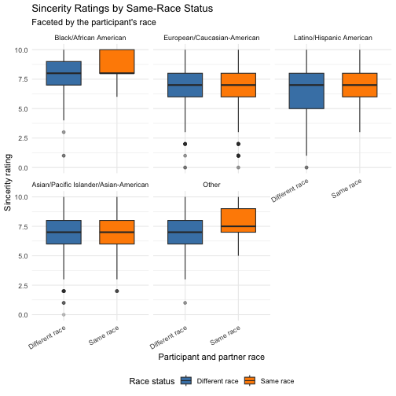

``` r
#shar
ggplot(
  rating_plot_data %>% filter(!is.na(shar)),
  aes(
    x = same_race_label,
    y = shar,
    fill = same_race_label
  )
) +
  geom_boxplot(width = 0.65, outlier.alpha = 0.25) +
  facet_wrap(~ race_label) +
  scale_fill_manual(
    values = c(
      "Different race" = "steelblue",
      "Same race" = "darkorange"
    )
  ) +
  labs(
    title = "Shared-Interest Ratings by Same-Race Status",
    subtitle = "Faceted by the participant's race",
    x = "Participant and partner race",
    y = "Shared-interest rating",
    fill = "Race status"
  ) +
  theme_minimal() +
  theme(
    legend.position = "bottom",
    axis.text.x = element_text(angle = 30, hjust = 1)
  )
```

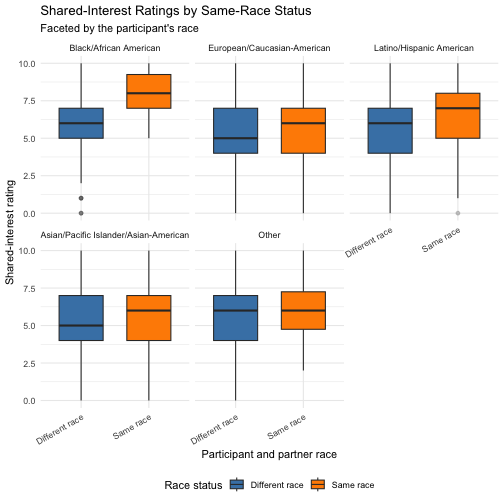

``` r
#amb
ggplot(
  rating_plot_data %>% filter(!is.na(amb)),
  aes(
    x = same_race_label,
    y = amb,
    fill = same_race_label
  )
) +
  geom_boxplot(width = 0.65, outlier.alpha = 0.25) +
  facet_wrap(~ race_label) +
  scale_fill_manual(
    values = c(
      "Different race" = "steelblue",
      "Same race" = "darkorange"
    )
  ) +
  labs(
    title = "Ambition Ratings by Same-Race Status",
    subtitle = "Faceted by the participant's race",
    x = "Participant and partner race",
    y = "Ambition rating",
    fill = "Race status"
  ) +
  theme_minimal() +
  theme(
    legend.position = "bottom",
    axis.text.x = element_text(angle = 30, hjust = 1)
  )
```

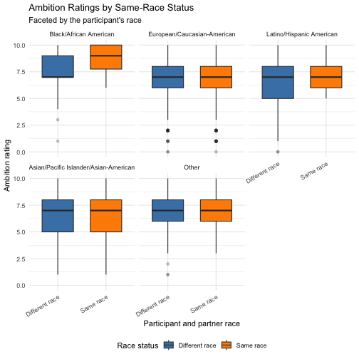

``` r
#int
ggplot(
  rating_plot_data %>% filter(!is.na(intel)),
  aes(
    x = same_race_label,
    y = intel,
    fill = same_race_label
  )
) +
  geom_boxplot(width = 0.65, outlier.alpha = 0.25) +
  facet_wrap(~ race_label) +
  scale_fill_manual(
    values = c(
      "Different race" = "steelblue",
      "Same race" = "darkorange"
    )
  ) +
  labs(
    title = "Intelligence Ratings by Same-Race Status",
    subtitle = "Faceted by the participant's race",
    x = "Participant and partner race",
    y = "Intelligence rating",
    fill = "Race status"
  ) +
  theme_minimal() +
  theme(
    legend.position = "bottom",
    axis.text.x = element_text(angle = 30, hjust = 1)
  )
```

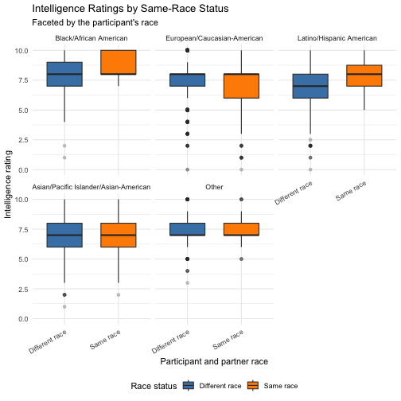


``` r
knitr::opts_chunk$set(echo = TRUE, message = FALSE, warning = FALSE)
set.seed(20260730)
```


``` r
speed_dating_data <- read.csv(
  "data/Speed_Dating_Data.csv",
  na.strings = c("", "NA"),
  stringsAsFactors = FALSE,
  check.names = FALSE
)

model_variables <- c(
  "iid", "dec", "gender", "age", "race", "age_o", "race_o", "samerace",
  "imprace",
  "attr", "sinc", "intel", "fun", "amb", "shar"
)

model_data <- speed_dating_data[, model_variables]
model_data$decision <- factor(
  ifelse(model_data$dec == 1, "Yes", "No"),
  levels = c("No", "Yes")
)
model_data$dec <- NULL

# This interaction operationalizes whether the participant's stated preference
# is aligned with the current partner: it is zero for a different-race partner
# and equals the participant's 0–10 imprace score for a same-race partner.
model_data$race_preference_alignment <-
  model_data$imprace * model_data$samerace

categorical_variables <- c("gender", "race", "race_o")
model_data[categorical_variables] <- lapply(
  model_data[categorical_variables],
  factor
)

model_data <- model_data[complete.cases(model_data), ]

# Split by participant, not by date row. Every observation for a participant
# is assigned to exactly one partition, preventing participant leakage.
set.seed(20260730)
participant_ids <- unique(model_data$iid)
train_iids <- sample(
  participant_ids,
  size = floor(0.80 * length(participant_ids))
)
train_rows <- which(model_data$iid %in% train_iids)
test_rows <- which(!model_data$iid %in% train_iids)

stopifnot(
  length(intersect(
    unique(model_data$iid[train_rows]),
    unique(model_data$iid[test_rows])
  )) == 0
)

dat <- model_data[, setdiff(names(model_data), "iid"), drop = FALSE]
train <- dat[train_rows, , drop = FALSE]
test <- dat[test_rows, , drop = FALSE]
y_test <- as.integer(test$decision == "Yes")

data.frame(
  partition = c("Train", "Test"),
  participants = c(
    length(unique(model_data$iid[train_rows])),
    length(unique(model_data$iid[test_rows]))
  ),
  decisions = c(length(train_rows), length(test_rows)),
  positive_rate = c(
    mean(train$decision == "Yes"),
    mean(test$decision == "Yes")
  )
)
```

```
##   partition participants decisions positive_rate
## 1     Train          422      5417     0.4251431
## 2      Test          106      1448     0.4564917
```


``` r
logistic_fit <- glm(
  decision ~ .,
  data = train,
  family = binomial()
)

probability_yes <- as.numeric(predict(logistic_fit, newdata = test, type = "response"))
logistic_probability <- probability_yes

# A deliberately restricted benchmark answers the research question more
# directly: how predictive are race-related variables without post-date
# ratings such as attractiveness, fun, or shared interests?
race_preference_fit <- glm(
  decision ~ race + race_o + samerace + imprace +
    race_preference_alignment,
  data = train,
  family = binomial()
)
race_preference_probability <- as.numeric(
  predict(race_preference_fit, newdata = test, type = "response")
)

classification_threshold <- 0.50
predicted <- as.integer(probability_yes >= classification_threshold)
```


``` r
confusion_matrix <- table(
  Actual = factor(y_test, levels = c(0, 1), labels = c("No", "Yes")),
  Predicted = factor(predicted, levels = c(0, 1), labels = c("No", "Yes"))
)
confusion_matrix
```

```
##       Predicted
## Actual  No Yes
##    No  637 150
##    Yes 197 464
```

``` r
tp <- confusion_matrix["Yes", "Yes"]
tn <- confusion_matrix["No", "No"]
fp <- confusion_matrix["No", "Yes"]
fn <- confusion_matrix["Yes", "No"]

safe_divide <- function(numerator, denominator) {
  if (denominator == 0) NA_real_ else numerator / denominator
}

accuracy <- safe_divide(tp + tn, sum(confusion_matrix))
precision <- safe_divide(tp, tp + fp)
recall <- safe_divide(tp, tp + fn)
f1_score <- safe_divide(2 * precision * recall, precision + recall)
```


``` r
roc_curve <- function(actual, score) {
  ordering <- order(score, decreasing = TRUE)
  ordered_actual <- actual[ordering]
  data.frame(
    false_positive_rate = c(0, cumsum(ordered_actual == 0) / sum(ordered_actual == 0)),
    true_positive_rate = c(0, cumsum(ordered_actual == 1) / sum(ordered_actual == 1))
  )
}

roc <- roc_curve(y_test, probability_yes)
roc_auc <- sum(diff(roc$false_positive_rate) *
  (head(roc$true_positive_rate, -1) + tail(roc$true_positive_rate, -1)) / 2)

plot(
  roc$false_positive_rate, roc$true_positive_rate,
  type = "s", lwd = 2, col = "#2166AC",
  xlab = "False positive rate", ylab = "True positive rate",
  main = sprintf("ROC curve (ROC-AUC = %.3f)", roc_auc)
)
abline(0, 1, lty = 2, col = "grey50")
legend(
  "bottomright",
  legend = c(sprintf("Logistic regression: ROC-AUC = %.3f", roc_auc),
             "No-discrimination reference"),
  col = c("#2166AC", "grey50"), lty = c(1, 2), lwd = c(2, 1), bty = "n"
)
```


``` r
pr_curve <- function(actual, score) {
  ordering <- order(score, decreasing = TRUE)
  ordered_actual <- actual[ordering]
  true_positive <- cumsum(ordered_actual == 1)
  data.frame(
    recall = c(0, true_positive / sum(ordered_actual == 1)),
    precision = c(1, true_positive / seq_along(ordered_actual))
  )
}

pr <- pr_curve(y_test, probability_yes)
prc_auc <- sum(diff(pr$recall) *
  (head(pr$precision, -1) + tail(pr$precision, -1)) / 2)
average_precision <- sum(diff(pr$recall) * tail(pr$precision, -1))

plot(
  pr$recall, pr$precision,
  type = "s", lwd = 2, col = "#B2182B",
  xlab = "Recall", ylab = "Precision",
  main = sprintf("Precision-recall curve (PRC-AUC = %.3f)", prc_auc)
)
abline(h = mean(y_test), lty = 2, col = "grey50")
legend(
  "bottomleft",
  legend = c(
    sprintf("Logistic regression: PRC-AUC = %.3f", prc_auc),
    sprintf("Average precision = %.3f", average_precision),
    sprintf("No-skill average Yes rate = %.3f", mean(y_test))
  ),
  col = c("#B2182B", "#B2182B", "grey50"),
  lty = c(1, 1, 2), lwd = c(2, 2, 1), bty = "n"
)
```


``` r
metrics <- data.frame(
  Metric = c(
    "Accuracy", "Precision", "Recall", "F1 Score",
    "ROC-AUC", "PRC-AUC", "Average precision"
  ),
  Value = c(
    accuracy, precision, recall, f1_score,
    roc_auc, prc_auc, average_precision
  )
)
knitr::kable(metrics, digits = 4)
```


|Metric            |  Value|
|:-----------------|------:|
|Accuracy          | 0.7604|
|Precision         | 0.7557|
|Recall            | 0.7020|
|F1 Score          | 0.7278|
|ROC-AUC           | 0.8299|
|PRC-AUC           | 0.7950|
|Average precision | 0.7952|

``` r
logistic_metrics <- data.frame(
  Model = "Logistic regression",
  Accuracy = accuracy,
  Precision = precision,
  Recall = recall,
  F1 = f1_score,
  ROC_AUC = roc_auc,
  Average_Precision = average_precision
)
```


``` r
bins <- cut(probability_yes, breaks = seq(0, 1, by = 0.10), include.lowest = TRUE)
calibration <- data.frame(
  mean_prediction = as.numeric(tapply(probability_yes, bins, mean)),
  observed_yes_rate = as.numeric(tapply(y_test, bins, mean))
)
calibration <- calibration[complete.cases(calibration), , drop = FALSE]

plot(
  calibration$mean_prediction, calibration$observed_yes_rate,
  type = "b", pch = 19, lwd = 2, col = "#4D9221",
  xlim = c(0, 1), ylim = c(0, 1),
  xlab = "Mean predicted probability", ylab = "Observed Yes rate",
  main = "Calibration plot"
)
abline(0, 1, lty = 2, col = "grey50")
```


``` r
coefficient_table <- data.frame(
  Variable = names(coef(logistic_fit)),
  Coefficient = as.numeric(coef(logistic_fit)),
  row.names = NULL
)
coefficient_table <- subset(coefficient_table, Variable != "(Intercept)")
coefficient_table$Odds_Ratio <- exp(coefficient_table$Coefficient)
coefficient_table$Direction <- ifelse(
  coefficient_table$Coefficient > 0,
  "Higher odds of Yes",
  "Lower odds of Yes"
)
coefficient_table <- coefficient_table[order(coefficient_table$Coefficient, decreasing = TRUE), ]

knitr::kable(coefficient_table, digits = 4)
```


|   |Variable                  | Coefficient| Odds_Ratio|Direction          |
|:--|:-------------------------|-----------:|----------:|:------------------|
|15 |attr                      |      0.5457|     1.7258|Higher odds of Yes |
|2  |gender1                   |      0.4403|     1.5532|Higher odds of Yes |
|18 |fun                       |      0.2956|     1.3440|Higher odds of Yes |
|20 |shar                      |      0.2737|     1.3148|Higher odds of Yes |
|21 |race_preference_alignment |      0.0804|     1.0837|Higher odds of Yes |
|17 |intel                     |      0.0484|     1.0496|Higher odds of Yes |
|3  |age                       |     -0.0095|     0.9905|Lower odds of Yes  |
|8  |age_o                     |     -0.0175|     0.9827|Lower odds of Yes  |
|10 |race_o3                   |     -0.0842|     0.9192|Lower odds of Yes  |
|9  |race_o2                   |     -0.0878|     0.9159|Lower odds of Yes  |
|16 |sinc                      |     -0.0987|     0.9060|Lower odds of Yes  |
|14 |imprace                   |     -0.1054|     0.9000|Lower odds of Yes  |
|11 |race_o4                   |     -0.1174|     0.8892|Lower odds of Yes  |
|13 |samerace                  |     -0.1244|     0.8831|Lower odds of Yes  |
|12 |race_o6                   |     -0.1360|     0.8729|Lower odds of Yes  |
|19 |amb                       |     -0.1856|     0.8306|Lower odds of Yes  |
|6  |race4                     |     -0.2449|     0.7828|Lower odds of Yes  |
|7  |race6                     |     -0.2628|     0.7689|Lower odds of Yes  |
|5  |race3                     |     -0.4931|     0.6108|Lower odds of Yes  |
|4  |race2                     |     -0.7255|     0.4841|Lower odds of Yes  |


``` r
coefficient_plot_data <- coefficient_table[order(coefficient_table$Coefficient), ]
old_par <- par(mar = c(5, 11, 4, 2) + 0.1)
barplot(
  coefficient_plot_data$Coefficient,
  names.arg = coefficient_plot_data$Variable,
  horiz = TRUE,
  las = 1,
  col = ifelse(coefficient_plot_data$Coefficient > 0, "#2166AC", "#B2182B"),
  main = "Logistic-regression coefficients",
  xlab = "Coefficient on the log-odds scale",
  cex.names = 0.75
)
abline(v = 0, lty = 2)
```


``` r
par(old_par)
```


``` r
knitr::opts_chunk$set(echo = TRUE, message = FALSE, warning = FALSE)
set.seed(20260730)
```


``` r
decision = 1  # Yes: the participant wants to see the partner again
decision = 0  # No
```


``` r
if (!requireNamespace("nnet", quietly = TRUE)) {
  stop("This report requires the nnet package. Install it with install.packages('nnet').")
}

library(nnet)

# Reuse the common complete-case cohort and participant-level partition created
# above so model performance is directly comparable.
table(dat$decision)
```

```
##
##   No  Yes
## 3901 2964
```


``` r
train <- dat[train_rows, , drop = FALSE]
test <- dat[test_rows, , drop = FALSE]

x_all <- model.matrix(decision ~ ., dat)[, -1, drop = FALSE]
x_train <- x_all[train_rows, , drop = FALSE]
x_test <- x_all[test_rows, , drop = FALSE]
y_train <- as.integer(train$decision == "Yes")
y_test <- as.integer(test$decision == "Yes")

train_means <- colMeans(x_train)
train_sds <- apply(x_train, 2, sd)
train_sds[is.na(train_sds) | train_sds == 0] <- 1

x_train_scaled <- sweep(sweep(x_train, 2, train_means, "-"), 2, train_sds, "/")
x_test_scaled <- sweep(sweep(x_test, 2, train_means, "-"), 2, train_sds, "/")
```


``` r
nn_fit <- nnet(
  x = x_train_scaled,
  y = y_train,
  size = 8,
  decay = 0.001,
  maxit = 500,
  entropy = TRUE,
  linout = FALSE,
  trace = FALSE,
  MaxNWts = 10000
)

probability_yes <- as.numeric(predict(nn_fit, x_test_scaled, type = "raw"))
nn_probability <- probability_yes

classification_threshold <- 0.50
predicted_decision <- factor(
  ifelse(probability_yes >= classification_threshold, "Yes", "No"),
  levels = c("No", "Yes")
)
actual_decision <- factor(test$decision, levels = c("No", "Yes"))

confusion_matrix <- table(
  Actual = actual_decision,
  Predicted = predicted_decision
)
confusion_matrix
```

```
##       Predicted
## Actual  No Yes
##    No  601 186
##    Yes 223 438
```


``` r
predictions <- data.frame(
  probability_yes = probability_yes,
  predicted_decision = predicted_decision,
  actual_decision = actual_decision
)
head(predictions)
```

```
##   probability_yes predicted_decision actual_decision
## 1      0.14993899                 No              No
## 2      0.90843670                Yes              No
## 3      0.61881902                Yes              No
## 4      0.91540371                Yes             Yes
## 5      0.87134080                Yes              No
## 6      0.04754057                 No              No
```


``` r
tp <- sum(y_test == 1 & predicted_decision == "Yes")
tn <- sum(y_test == 0 & predicted_decision == "No")
fp <- sum(y_test == 0 & predicted_decision == "Yes")
fn <- sum(y_test == 1 & predicted_decision == "No")

safe_divide <- function(numerator, denominator) {
  if (denominator == 0) NA_real_ else numerator / denominator
}

auc <- function(actual, scores) {
  positive <- actual == 1
  n_positive <- sum(positive)
  n_negative <- sum(!positive)
  if (n_positive == 0 || n_negative == 0) return(NA_real_)
  ranks <- rank(scores, ties.method = "average")
  (sum(ranks[positive]) - n_positive * (n_positive + 1) / 2) /
    (n_positive * n_negative)
}

accuracy <- safe_divide(tp + tn, length(y_test))
sensitivity <- safe_divide(tp, tp + fn)
specificity <- safe_divide(tn, tn + fp)
precision <- safe_divide(tp, tp + fp)
f1_score <- safe_divide(
  2 * precision * sensitivity,
  precision + sensitivity
)
balanced_accuracy <- mean(c(sensitivity, specificity), na.rm = TRUE)

pr_ordering <- order(probability_yes, decreasing = TRUE)
pr_actual <- y_test[pr_ordering]
pr_true_positive <- cumsum(pr_actual == 1)
pr_recall <- c(0, pr_true_positive / sum(pr_actual == 1))
pr_precision <- c(1, pr_true_positive / seq_along(pr_actual))
prc_auc <- sum(diff(pr_recall) *
  (head(pr_precision, -1) + tail(pr_precision, -1)) / 2)
average_precision <- sum(diff(pr_recall) * tail(pr_precision, -1))

metrics <- data.frame(
  threshold = classification_threshold,
  accuracy = accuracy,
  sensitivity_yes = sensitivity,
  specificity_no = specificity,
  balanced_accuracy = balanced_accuracy,
  roc_auc = auc(y_test, probability_yes),
  prc_auc = prc_auc,
  average_precision = average_precision
)
metrics
```

```
##   threshold  accuracy sensitivity_yes specificity_no balanced_accuracy
## 1       0.5 0.7175414       0.6626324      0.7636595         0.7131459
##     roc_auc   prc_auc average_precision
## 1 0.7937417 0.7515837         0.7519494
```

``` r
nn_metrics <- data.frame(
  Model = "Neural network",
  Accuracy = accuracy,
  Precision = precision,
  Recall = sensitivity,
  F1 = f1_score,
  ROC_AUC = metrics$roc_auc,
  Average_Precision = average_precision
)
```


``` r
graph_dir <- file.path("graphs", "neural_network")
dir.create(graph_dir, recursive = TRUE, showWarnings = FALSE)

save_png <- function(filename, plot_function, width = 1600, height = 1000) {
  png(file.path(graph_dir, filename), width = width, height = height, res = 180)
  on.exit(dev.off(), add = TRUE)
  plot_function()
}

plot_class_balance <- function() {
  counts <- table(dat$decision)
  barplot(
    counts,
    col = c("#4C78A8", "#F58518"),
    ylab = "Number of decisions",
    main = "Class balance in the modeling data"
  )
}

plot_confusion_matrix <- function() {
  plot.new()
  plot.window(xlim = c(0, 2), ylim = c(0, 2))
  title("Neural network confusion matrix (test set)")
  for (row in seq_len(2)) {
    for (column in seq_len(2)) {
      x_left <- column - 1
      y_bottom <- 2 - row
      fill <- if (row == column) "#B7D8B7" else "#F2C2C2"
      rect(x_left, y_bottom, x_left + 1, y_bottom + 1, col = fill, border = "white")
      text(x_left + 0.5, y_bottom + 0.5, confusion_matrix[row, column], cex = 1.6)
    }
  }
  axis(1, at = c(0.5, 1.5), labels = colnames(confusion_matrix), tick = FALSE)
  axis(2, at = c(1.5, 0.5), labels = rownames(confusion_matrix), tick = FALSE, las = 1)
  mtext("Predicted decision", side = 1, line = 2.4)
  mtext("Actual decision", side = 2, line = 2.4)
  box()
}

roc_curve <- function(actual, scores) {
  ordering <- order(scores, decreasing = TRUE)
  ordered_actual <- actual[ordering]
  positive_total <- sum(ordered_actual == 1)
  negative_total <- sum(ordered_actual == 0)
  data.frame(
    false_positive_rate = c(0, cumsum(ordered_actual == 0) / negative_total),
    true_positive_rate = c(0, cumsum(ordered_actual == 1) / positive_total)
  )
}

pr_curve <- function(actual, scores) {
  ordering <- order(scores, decreasing = TRUE)
  ordered_actual <- actual[ordering]
  true_positive <- cumsum(ordered_actual == 1)
  data.frame(
    recall = c(0, true_positive / sum(ordered_actual == 1)),
    precision = c(1, true_positive / seq_along(ordered_actual))
  )
}

roc_values <- roc_curve(y_test, probability_yes)
pr_values <- pr_curve(y_test, probability_yes)

plot_roc <- function() {
  plot(
    roc_values$false_positive_rate, roc_values$true_positive_rate,
    type = "l", lwd = 3, col = "#4C78A8",
    xlab = "False positive rate", ylab = "True positive rate",
    main = sprintf("ROC curve (ROC-AUC = %.3f)", metrics$roc_auc),
    xlim = c(0, 1), ylim = c(0, 1)
  )
  abline(0, 1, lty = 2, col = "gray50")
  legend(
    "bottomright",
    legend = c(sprintf("Model: ROC-AUC = %.3f", metrics$roc_auc),
               "No-discrimination reference"),
    col = c("#4C78A8", "gray50"), lty = c(1, 2), lwd = c(3, 1), bty = "n"
  )
}

plot_precision_recall <- function() {
  plot(
    pr_values$recall, pr_values$precision,
    type = "l", lwd = 3, col = "#F58518",
    xlab = "Recall (sensitivity for Yes)", ylab = "Precision",
    main = sprintf("Precision-recall curve (PRC-AUC = %.3f)", prc_auc),
    xlim = c(0, 1), ylim = c(0, 1)
  )
  abline(h = mean(y_test), lty = 2, col = "gray50")
  legend(
    "bottomleft",
    legend = c(
      sprintf("Model: PRC-AUC = %.3f; average precision = %.3f", prc_auc, average_precision),
      sprintf("No-skill average Yes rate = %.3f", mean(y_test))
    ),
    col = c("#F58518", "gray50"), lty = c(1, 2), lwd = c(3, 1), bty = "n"
  )
}

plot_probability_distribution <- function() {
  no_scores <- probability_yes[y_test == 0]
  yes_scores <- probability_yes[y_test == 1]
  breaks <- seq(0, 1, by = 0.05)
  no_histogram <- hist(no_scores, breaks = breaks, plot = FALSE)
  yes_histogram <- hist(yes_scores, breaks = breaks, plot = FALSE)
  ymax <- max(c(no_histogram$counts, yes_histogram$counts))
  plot(
    no_histogram, col = rgb(0.30, 0.47, 0.66, 0.55), border = "white",
    xlim = c(0, 1), ylim = c(0, ymax),
    xlab = "Predicted probability of Yes", ylab = "Test-set count",
    main = "Predicted-probability distribution by actual decision"
  )
  plot(yes_histogram, col = rgb(0.96, 0.52, 0.09, 0.55), border = "white", add = TRUE)
  abline(v = classification_threshold, lty = 2, lwd = 2)
  legend(
    "topright", legend = c("Actual No", "Actual Yes", "0.50 threshold"),
    fill = c(rgb(0.30, 0.47, 0.66, 0.55), rgb(0.96, 0.52, 0.09, 0.55), NA),
    border = c("white", "white", NA), lty = c(NA, NA, 2), bty = "n"
  )
}

plot_calibration <- function() {
  bins <- cut(probability_yes, breaks = seq(0, 1, by = 0.10), include.lowest = TRUE)
  calibration <- data.frame(
    predicted_probability = as.numeric(tapply(probability_yes, bins, mean)),
    observed_yes_rate = as.numeric(tapply(y_test, bins, mean))
  )
  calibration <- calibration[complete.cases(calibration), , drop = FALSE]
  plot(
    calibration$predicted_probability, calibration$observed_yes_rate,
    pch = 19, cex = 1.2, col = "#54A24B",
    xlab = "Mean predicted probability", ylab = "Observed Yes rate",
    main = "Calibration plot (test set)", xlim = c(0, 1), ylim = c(0, 1)
  )
  lines(calibration$predicted_probability, calibration$observed_yes_rate,
        col = "#54A24B", lwd = 2)
  abline(0, 1, lty = 2, col = "gray50")
}

set.seed(20260730)
baseline_accuracy <- mean(as.integer(predicted_decision == "Yes") == y_test)
permutation_importance <- vapply(seq_len(ncol(x_test_scaled)), function(column) {
  permuted_test <- x_test_scaled
  permuted_test[, column] <- sample(permuted_test[, column])
  permuted_probability <- as.numeric(predict(nn_fit, permuted_test, type = "raw"))
  permuted_prediction <- as.integer(permuted_probability >= classification_threshold)
  baseline_accuracy - mean(permuted_prediction == y_test)
}, numeric(1))
names(permutation_importance) <- colnames(x_test_scaled)

importance <- sort(permutation_importance, decreasing = TRUE)

plot_permutation_importance <- function() {
  barplot(
    rev(importance), names.arg = rev(names(importance)),
    horiz = TRUE, las = 1, col = "#72B7B2",
    xlab = "Decrease in test accuracy after permutation",
    main = "Permutation importance of encoded predictors"
  )
  abline(v = 0, lty = 2, col = "gray50")
}

save_png("01_class_balance.png", plot_class_balance)
save_png("02_confusion_matrix.png", plot_confusion_matrix)
save_png("03_roc_curve.png", plot_roc)
save_png("04_precision_recall_curve.png", plot_precision_recall)
save_png("05_probability_distribution.png", plot_probability_distribution)
save_png("06_calibration_plot.png", plot_calibration)
save_png("07_permutation_importance.png", plot_permutation_importance)

graph_files <- file.path(
  graph_dir,
  c(
    "01_class_balance.png", "02_confusion_matrix.png", "03_roc_curve.png",
    "04_precision_recall_curve.png", "05_probability_distribution.png",
    "06_calibration_plot.png", "07_permutation_importance.png"
  )
)
```


``` r
if (requireNamespace("knitr", quietly = TRUE)) {
  knitr::include_graphics(graph_files)
} else {
  graph_files
}
```

<div class="figure">
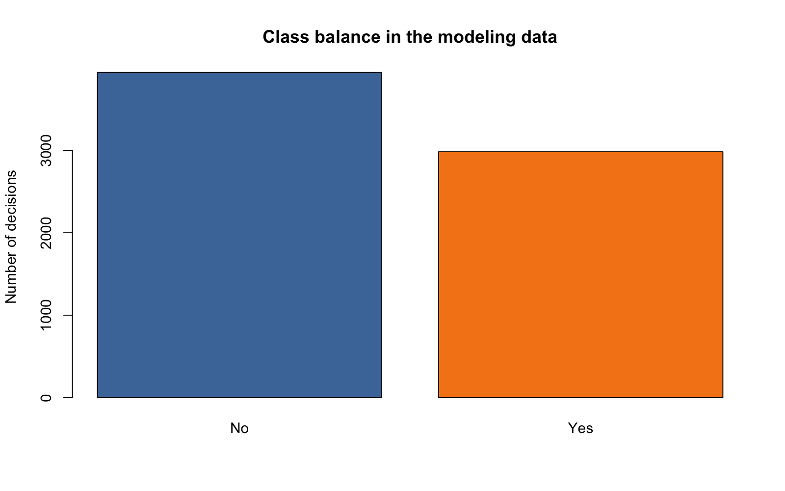
<p class="caption">plot of chunk unnamed-chunk-23</p>
</div><div class="figure">
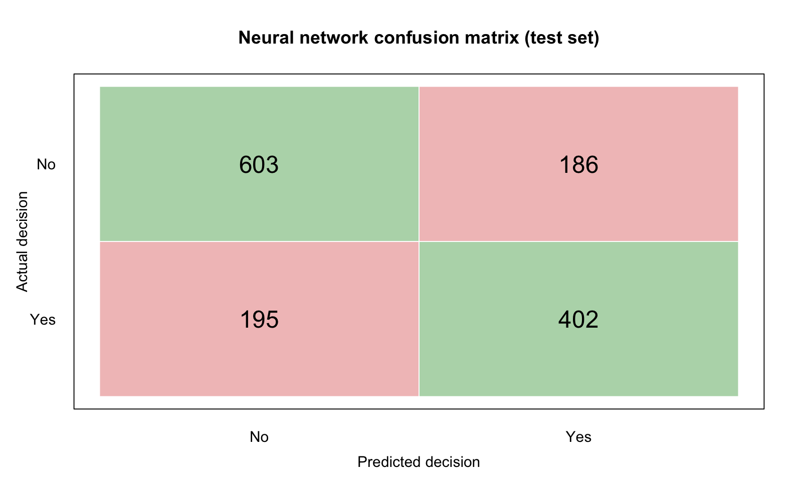
<p class="caption">plot of chunk unnamed-chunk-23</p>
</div><div class="figure">
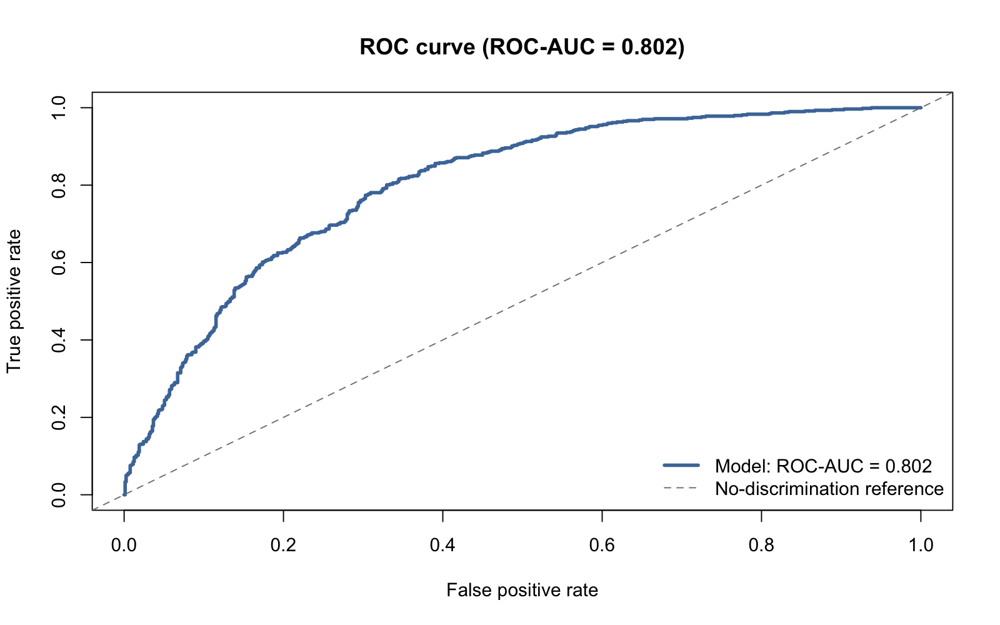
<p class="caption">plot of chunk unnamed-chunk-23</p>
</div><div class="figure">
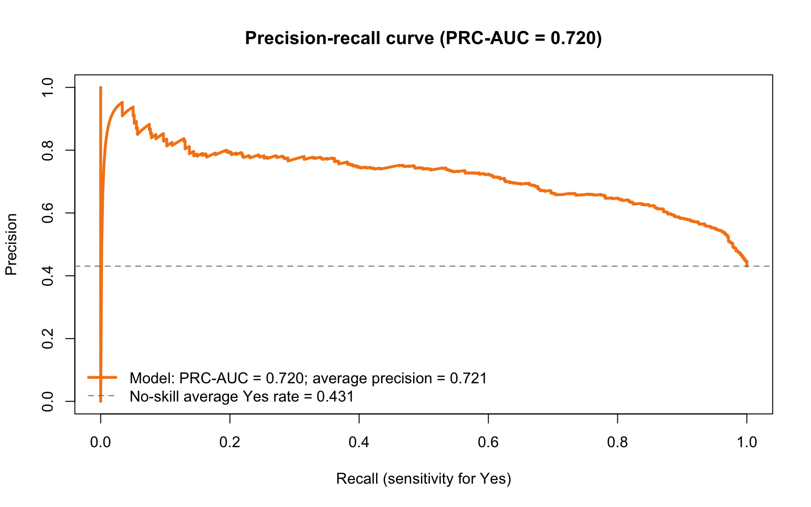
<p class="caption">plot of chunk unnamed-chunk-23</p>
</div><div class="figure">
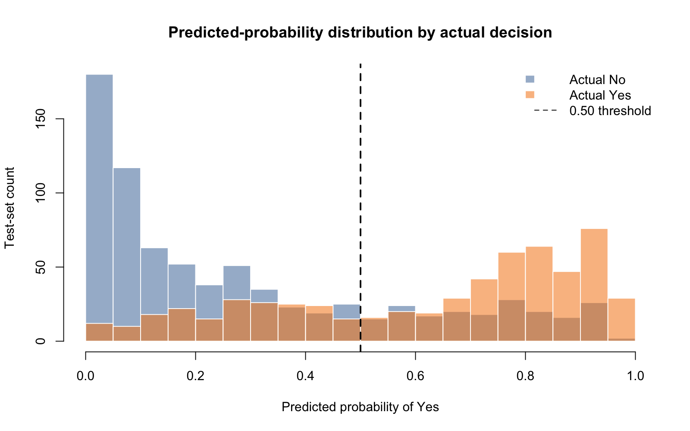
<p class="caption">plot of chunk unnamed-chunk-23</p>
</div><div class="figure">
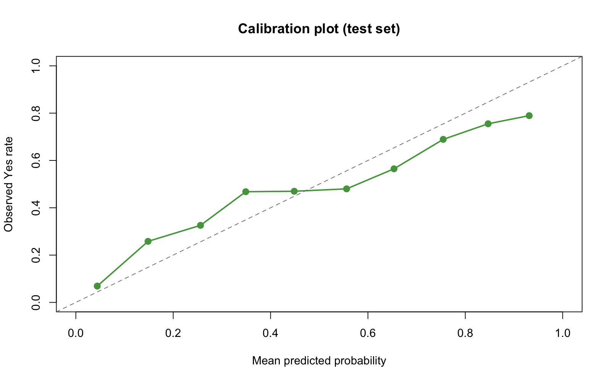
<p class="caption">plot of chunk unnamed-chunk-23</p>
</div><div class="figure">
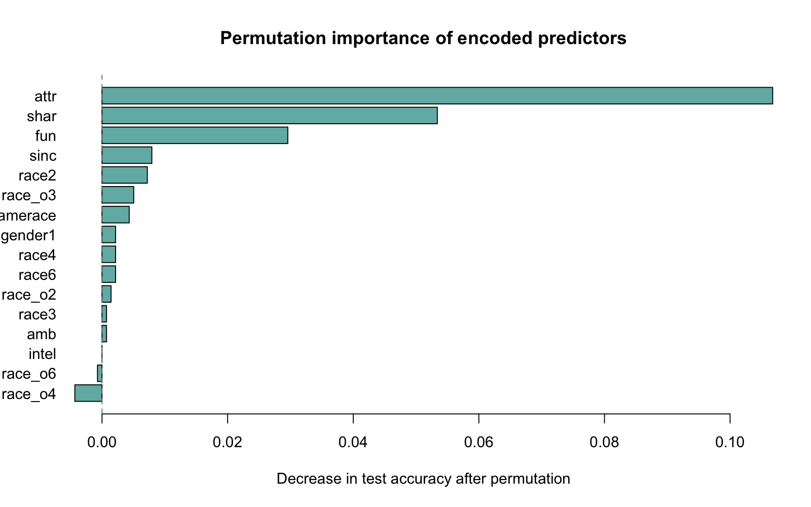
<p class="caption">plot of chunk unnamed-chunk-23</p>
</div>


``` r
if (!requireNamespace("randomForest", quietly = TRUE)) {
  stop("This report requires the randomForest package.")
}
if (!requireNamespace("pROC", quietly = TRUE)) {
  stop("This report requires the pROC package.")
}
options(scipen = 0, digits = 3)
```


``` r
# Reuse the same predictors, complete cases, and participant-level split used
# by logistic regression and the neural network.
data1 <- dat
rf_train <- data1[train_rows, , drop = FALSE]
rf_test <- data1[test_rows, , drop = FALSE]
```


``` r
# The OOB curve remains useful as a training diagnostic, but final performance
# is computed on the common held-out participant test set.
set.seed(20260730)
fit.rf <- randomForest::randomForest(
  decision ~ .,
  data = rf_train,
  mtry = 4,
  ntree = 500,
  importance = TRUE
)

# names(fit.rf)
```


``` r
# Held-out predictions for direct comparison with the other two models.
rf_probability <- as.numeric(
  predict(fit.rf, newdata = rf_test, type = "prob")[, "Yes"]
)
rf_predicted <- factor(
  ifelse(rf_probability >= 0.50, "Yes", "No"),
  levels = c("No", "Yes")
)
rf_actual <- factor(rf_test$decision, levels = c("No", "Yes"))

table(
  Actual = rf_actual,
  Predicted = rf_predicted
)
```

```
##       Predicted
## Actual  No Yes
##    No  636 151
##    Yes 222 439
```

``` r
# OOB classification error across trees is shown only as a training diagnostic.
plot(
  fit.rf,
  type = "l",
  col = c("black", "blue", "red"),
  main = "Random-forest training diagnostic: OOB error"
)
```


``` r
randomForest::importance(fit.rf)
```

```
##                              No    Yes MeanDecreaseAccuracy MeanDecreaseGini
## gender                    20.65  36.67                39.53             58.3
## age                       26.27  32.42                41.41            248.9
## race                      18.41  26.30                30.24            117.3
## age_o                      2.43   4.07                 4.52            223.4
## race_o                     4.80   6.02                 7.82            114.1
## samerace                   7.06   4.22                 8.38             31.6
## imprace                   26.70  33.15                40.97            181.6
## attr                      63.41 116.58               123.42            500.7
## sinc                       7.14  30.16                28.72            162.3
## intel                      9.71  23.36                25.41            146.4
## fun                       41.47  44.14                63.26            278.7
## amb                       12.96  20.48                24.42            163.0
## shar                      41.04  53.72                66.84            296.8
## race_preference_alignment  7.82  13.18                16.26             95.7
```

``` r
randomForest::varImpPlot(fit.rf)
```


``` r
test_actual_yes <- rf_actual == "Yes"
```


``` r
# ROC curve: sensitivity versus false-positive rate across all thresholds.
roc_object <- pROC::roc(
  response = rf_actual,
  predictor = rf_probability,
  levels = c("No", "Yes"),
  direction = "<",
  quiet = TRUE
)

plot(
  roc_object,
  legacy.axes = TRUE,
  print.auc = TRUE,
  col = "blue",
  lwd = 2,
  main = "Random-Forest ROC Curve (Common Test Set)"
)
abline(a = 0, b = 1, lty = 2, col = "gray50")
```


``` r
roc_auc <- as.numeric(pROC::auc(roc_object))
roc_auc
```

```
## [1] 0.831
```


``` r
# PR curve: precision versus recall for the positive ("Yes") class.
# Predictions with the same probability are grouped at one threshold.
pr_curve <- tibble::tibble(
  actual_yes = test_actual_yes,
  probability = rf_probability
) |>
  dplyr::group_by(probability) |>
  dplyr::summarise(
    positive_count = sum(actual_yes),
    negative_count = sum(!actual_yes),
    .groups = "drop"
  ) |>
  dplyr::arrange(dplyr::desc(probability)) |>
  dplyr::mutate(
    true_positive = cumsum(positive_count),
    false_positive = cumsum(negative_count),
    recall = true_positive / sum(test_actual_yes),
    precision = true_positive / (true_positive + false_positive)
  )

# Average precision summarizes the PR curve; larger values are better.
average_precision <- sum(
  c(pr_curve$recall[1], diff(pr_curve$recall)) * pr_curve$precision
)

pr_plot_data <- dplyr::bind_rows(
  tibble::tibble(recall = 0, precision = 1),
  dplyr::select(pr_curve, recall, precision)
)

positive_prevalence <- mean(test_actual_yes)

ggplot2::ggplot(
  pr_plot_data,
  ggplot2::aes(x = recall, y = precision)
) +
  ggplot2::geom_step(direction = "hv", color = "blue", linewidth = 1) +
  ggplot2::geom_hline(
    yintercept = positive_prevalence,
    linetype = 2,
    color = "gray50"
  ) +
  ggplot2::coord_cartesian(xlim = c(0, 1), ylim = c(0, 1)) +
  ggplot2::labs(
    title = "Random-Forest Precision-Recall Curve (Common Test Set)",
    subtitle = paste("Average precision =", round(average_precision, 3)),
    x = "Recall",
    y = "Precision"
  ) +
  ggplot2::theme_minimal()
```


``` r
average_precision
```

```
## [1] 0.792
```


``` r
# Calibration compares predicted "Yes" probabilities with observed "Yes"
# frequencies. Ten groups of approximately equal size are used.
calibration_data <- tibble::tibble(
  actual_yes = as.numeric(test_actual_yes),
  predicted_probability = rf_probability
) |>
  dplyr::mutate(bin = dplyr::ntile(predicted_probability, 10)) |>
  dplyr::group_by(bin) |>
  dplyr::summarise(
    mean_predicted_probability = mean(predicted_probability),
    observed_yes_rate = mean(actual_yes),
    observations = dplyr::n(),
    .groups = "drop"
  )

ggplot2::ggplot(
  calibration_data,
  ggplot2::aes(
    x = mean_predicted_probability,
    y = observed_yes_rate
  )
) +
  ggplot2::geom_abline(
    intercept = 0,
    slope = 1,
    linetype = 2,
    color = "gray50"
  ) +
  ggplot2::geom_line(color = "blue", linewidth = 1) +
  ggplot2::geom_point(
    ggplot2::aes(size = observations),
    color = "blue",
    show.legend = FALSE
  ) +
  ggplot2::coord_equal(xlim = c(0, 1), ylim = c(0, 1)) +
  ggplot2::labs(
    title = "Random-Forest Calibration Plot (Common Test Set)",
    x = "Mean predicted probability",
    y = "Observed Yes rate"
  ) +
  ggplot2::theme_minimal()
```


``` r
# Brier score is the mean squared error of the predicted probabilities.
# Smaller values indicate better probabilistic predictions.
brier_score <- mean(
  (rf_probability - as.numeric(test_actual_yes))^2
)
brier_score
```

```
## [1] 0.169
```

## Direct model comparison

All models below use the same complete-case observations, participant-level
training partition, participant-level test partition, classification threshold,
and metric definitions. The three full models use identical predictors. The
race-related benchmark is intentionally restricted to `race`, `race_o`,
`samerace`, `imprace`, and the preference-alignment interaction.


``` r
# One evaluator is applied to every probability vector. This guarantees that
# thresholding, confusion-matrix metrics, ROC-AUC, and average precision use
# identical definitions for all three models.
evaluate_test_predictions <- function(model_name, actual, probability,
                                      threshold = 0.50) {
  predicted <- as.integer(probability >= threshold)
  tp <- sum(actual == 1 & predicted == 1)
  tn <- sum(actual == 0 & predicted == 0)
  fp <- sum(actual == 0 & predicted == 1)
  fn <- sum(actual == 1 & predicted == 0)

  precision <- safe_divide(tp, tp + fp)
  recall <- safe_divide(tp, tp + fn)

  ordering <- order(probability, decreasing = TRUE)
  ordered_actual <- actual[ordering]
  cumulative_tp <- cumsum(ordered_actual == 1)
  recall_curve <- c(0, cumulative_tp / sum(ordered_actual == 1))
  precision_curve <- c(1, cumulative_tp / seq_along(ordered_actual))
  average_precision <- sum(
    diff(recall_curve) * tail(precision_curve, -1)
  )

  data.frame(
    Model = model_name,
    Accuracy = safe_divide(tp + tn, length(actual)),
    Precision = precision,
    Recall = recall,
    F1 = safe_divide(2 * precision * recall, precision + recall),
    ROC_AUC = auc(actual, probability),
    Average_Precision = average_precision
  )
}

model_comparison <- dplyr::bind_rows(
  evaluate_test_predictions(
    "Race-related benchmark", y_test, race_preference_probability
  ),
  evaluate_test_predictions(
    "Logistic regression", y_test, logistic_probability
  ),
  evaluate_test_predictions(
    "Neural network", y_test, nn_probability
  ),
  evaluate_test_predictions(
    "Random forest", y_test, rf_probability
  )
)

knitr::kable(
  model_comparison,
  digits = 3,
  caption = "Models evaluated with one metric function on the same held-out participants"
)
```


Table: Models evaluated with one metric function on the same held-out participants

|Model                  | Accuracy| Precision| Recall|    F1| ROC_AUC| Average_Precision|
|:----------------------|--------:|---------:|------:|-----:|-------:|-----------------:|
|Race-related benchmark |    0.588|     0.608|  0.277| 0.380|   0.601|             0.550|
|Logistic regression    |    0.760|     0.756|  0.702| 0.728|   0.830|             0.795|
|Neural network         |    0.718|     0.702|  0.663| 0.682|   0.794|             0.752|
|Random forest          |    0.742|     0.744|  0.664| 0.702|   0.831|             0.793|
